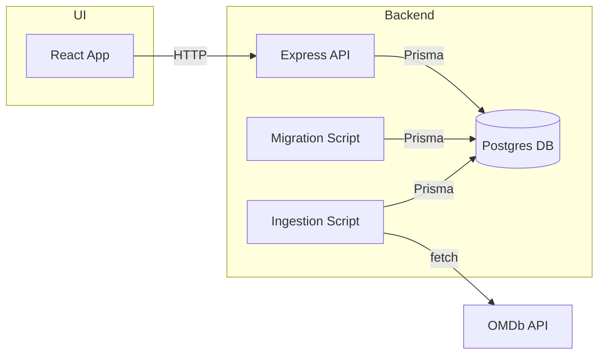

# Movie Search Challenge

This project consists of two main components:

- **search-service** – a Node.js/Express server providing a REST API backed by Postgres and Prisma
- **search-ui** – a React application that consumes the API

The repository also contains Docker configurations to run the full stack locally.

## Quick start

1. Copy the environment variables for the service:

   ```bash
   cp search-service/.env.example search-service/.env
   ```

2. Build and start the containers in development mode:

   ```bash
   docker compose -f compose.dev.yaml up --build
   ```

3. (Optional) If you want to run the app in optimized production mode, use:

   ```bash
   docker compose -f compose.prod.yaml up --build
   ```

If you are using an older Compose version, run `docker-compose` instead of `docker compose`.

This command starts a Postgres database, the Node.js service, runs migrations and data ingestion, and finally launches the React UI.

The UI will be available at [http://localhost:3000](http://localhost:3000) for development mode, and at [http://localhost](http://localhost) for production mode. The backend service will be available at [http://localhost:4000](http://localhost:4000) in both modes.

To stop the stack:

```bash
docker compose -f compose.dev.yaml down
```
or

```bash
docker compose -f compose.prod.yaml down
```

## Using the app

Open the UI in your browser and use the search field to look for movies by title, director or plot. Results are fetched from the API and displayed as cards with optional images and descriptions. The API endpoint can also be queried directly:

```
GET http://localhost:4000/movies?searchTerm=space
```

## Architecture overview

The application is split into frontend and backend services coordinated via Docker Compose. On startup the migration and ingestion steps populate the Postgres database with sample data fetched from the OMDb API.



The React app sends search requests to the Express API. The API queries the Postgres database using Prisma ORM. On the initial startup an ingestion script downloads movies from the OMDb API and stores them in the database.

